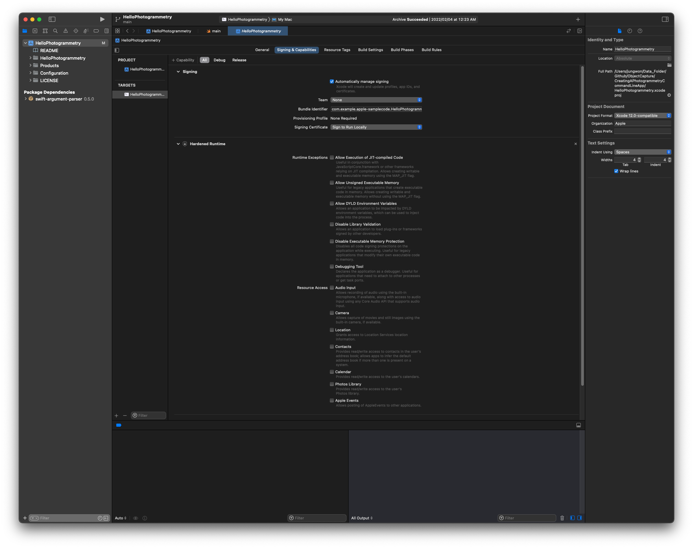

# ObjectCaprue

WWDC21에서 발표된 ObjectCapture 예제에 대해 정리한 내용입니다.

`Create 3D models with Object Capture`는 이미지 기반으로 3D 모델을 쉽고 빠르게 만들기 위한 예제입니다.

OSX용 Photogrammetry 예제를 통해 이미지 캡처를 활용하여 3D 모델을 쉽게 생성할 수 있습니다.

Apple `Create 3D models with Object Capture` 예제 : [링크 이동](https://developer.apple.com/videos/play/wwdc2021/10076/)

## Apple ObjectCapture(HelloPhotogrammetry)

Photogrammetry Command-Line App : [다운로드 링크](https://developer.apple.com/documentation/realitykit/creating_a_photogrammetry_command-line_app)

해당 예제를 실행하기 위해서는 macOS 12.0+(Monterey이상) & Xcode 13.0 Version 이상이 필요합니다.

3D 모델링 제작을 위해 필요한 사진은 Apple의 Object Capture 공식 웹페이지에서 다운로드가 가능합니다.

([Object Capture 공식 웹페이지](https://developer.apple.com/augmented-reality/object-capture/))

  

<예제에서 제공되는 이미지>
- Nike Ar Force 1
- Nike Pegasus
- Fruit Cake
- Lemon Meringue Pie
- Rock

<이미지를 통해 만들 수 있는 결과물>
- USDZ 형태의 3D 모델링 파일

## HelloPhotogrammetry 예제 실행 방법

Download 받은 예제의 Xcode Project를 실행합니다.

Project 설정 -> General 설정의 Deployment Target 버전을 12.0으로 변경합니다.

Signing & Capabilities 설정의 Code Signing은 Local 실행을 위한 "Sign to Run Locally"를 선택합니다.

프로젝트 빌드를 위한 Code Signing까지 완료했으면, 프로젝트를 빌드합니다.  

해당 프로젝트를 빌드하면 code:64 에러를 발생하는 것을 확인 할 수 있습니다.

해당 에러코드는 main 함수에서 프로젝트 빌드에 필요한 필수 파라미터가 없어서 발생되는 에러입니다.

따라서, 실행된 터미널 결과에 나와있는 필수 Arguments 값과 Option 값을 추가하여 빌드하면 예제를 정상적으로 실행 할 수 있습니다.  

원하는 파라미터를 넣어서 실행하기 위해 해당 프로젝트를 먼저 배포 형태(Archive)로 만들어 줍니다.

프로젝트 상단의 "Product" -> "Archive" 실행

 "Distribute Content" 실행 

 Archive를 완료하면, 아래와 같은 exec 실행 파일이 생성됩니다. 

exec 파일을 실행하기 위해서 터미널에서 해당 exec 파일까지 경로 이동을 합니다.

이동한 경로에서 필수 파라미터를 추가하여, exec 파일을 실행합니다.

~~~
$ ./HelloPhotogrammetry (inputPath) (outputPath) -d (option) -o (option) -f (option)

> inputPath : 3D Modeling을 만들기 위한 이미지가 저장되어있는 폴더의 경로
> outputPath : 이미지를 통해 만들어질 3D Modeling(USDZ 파일)이 만들어질 경로, .usdz 확장자를 사용해야됨
> -d : 모델링 디테일 값으로 Mesh 사이즈나 Texture 사이즈에 대한 옵션(preview, reduced, medium, full, raw)
> -o : image 연산처리를 위해 이미지가 연속적인 패턴으로 되어있는지에 대한 옵션(unorderd, sequential)
> -f : 스캔한 Object를 식별할 수 있는 구조, Edge나 Texture가 많이 없는 경우, high로 설정을 권장하는 옵션(normal, high)
~~~

위의 arguments와 option 값을 추가하여 실행한 후, "활성 상태 보기" 앱에서 디스크 모니터링을 통해 정상적으로 실행되고 있는지 유무를 확인할 수 있습니다.

정상적으로 실행이 완료되면, 아래와 같이 생성된 모델링 파일(usdz)을 확인할 수 있습니다.

usdz 형태의 파일로 정상적으로 3D Modeling이 생성된 것을 확인 할 수 있습니다.

